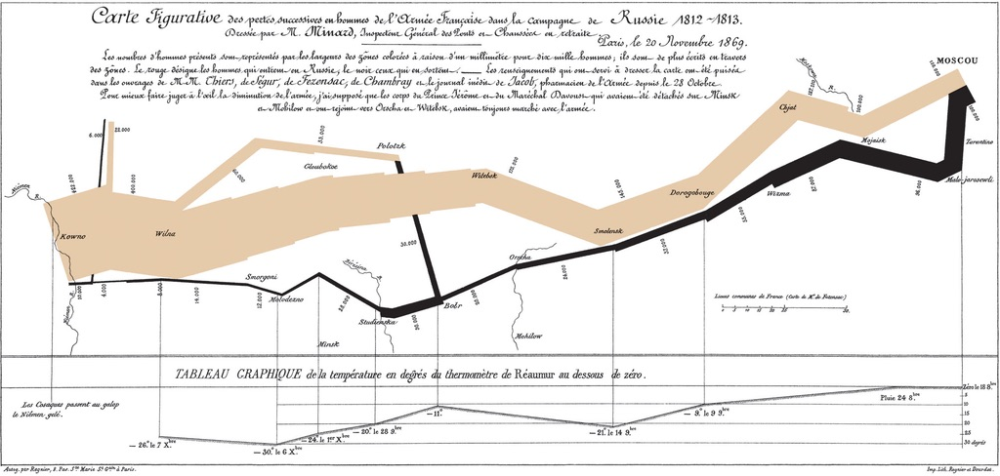
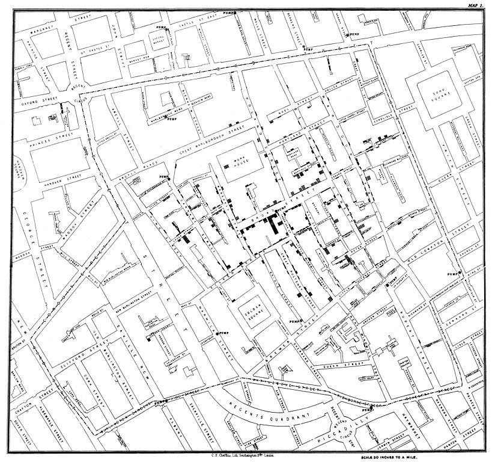
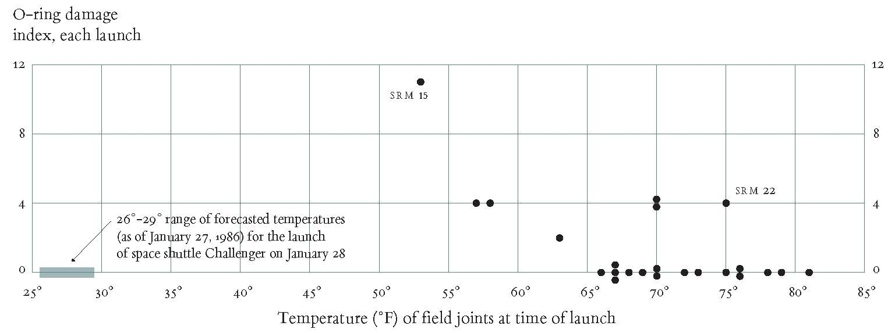

#  The Value of Data Visualization

In the following section, I highlight the value of data visualizations, which is caused by an increasing availability of data. I highlight these values by different typical examples from data visualizations. 

When thinking about the value of data visualization we should consider the increasing importance of data in our society. Over the last century the availability of data in the world is growing exponentially. We now have data whose scope is no longer imaginable. 

According to *statista*^[*statistics* is a statistics database that makes data from market and opinion research institutions as well as from business and official statistics available in various Languages.] the total amount of data reached almost 65 zettabytes in 2020 [@statista2021]. This growth was higher than previously expected due to the COVID-19 pandemic, as more and more people work and study from home and make more use of home entertainment options. However, in 2020, the installed storage capacity reached 6.7 zettabytes, thus, only a small proportion of the created data was kept. During the forecast period from 2020 to 2025, *statista* states an average annual growth rate of 19.2 % in storage capacity [@statista2021]. 

<!-- Include discussion on big data and reference to machine learning? -->

Just to recall, a zettabyte is a unit of measurement for storage capacity and stands for 10^21 bytes. That's trillions of bytes, or in numbers, 1,000,000,000,000,000,000 bytes. This in turn is equal to 1,000 exabytes or one billion terabytes.

Besides the aforementioned data that are created by using social media, there are many other types of data that contributed to the need for higher storage capacity. Just to give you some examples of available data: there are geographical, cultural, scientific, financial, statistical, meteorological, natural, and transport data.

Even though, we have all these data available, already in 1999 Edward O. Wilson concluded [@wilson1999consilience]:
> "We are drowning in information, while starving for wisdom.
> The world henceforth will be run by synthesizers, people able to put together the right information 
> at the right time, think critically about it, and make important choices wisely.
> It went a lot faster with two people digging."

This quote nicely summarize the challenges we face in data visualization. Even though, we have a lot of data available it turns out that we need the ''right information'' at the ''right time''. However, we need ''think critically'' about these data in order to be able to ''make important choices wisely''. One of these important decisions concern how we represent the data. 

We are especially concerned with ''the visual representation and presentation of data to facilitate understanding''[@kirk2019data]. Representation relates to the visual depiction of your data, whereas the presentation relates to specific design choices of your visual depiction, such as the composition, the colors used, the interactivity supported, and the annotations provided. 

When people view your visualization, they go through a process consisting of perceiving, interpreting, and comprehending [@kirk2019data]. In reality, these steps occur in parallel. This first first is simply about perceiving, i.e. reading the chart. People try to understand the main features of the visualizations. In the phase interpreting, these observations are translated into meaning which also involves that people map their interpretation onto their own knowledge about this domain. Especially in situations, where people might not have enough knowledge in the visualized domain, a gap between the observation and the meaning might occur. This gap needs to be recognized and bridged. In the third phase of understanding people reflect on what the interpretation means to themselves. This phase depends especially on your viewers, since what might be a learning for one person, might be cryptic for another.

## Example Visualizations

In the following, we use this framework to discuss three examples for well-received visualization examples. 

```{r, out.width='75%', fig.align='center', fig.cap="Snow's map shows cholera cases in London during the 1854 epidemic. Taken from https://commons.wikimedia.org/wiki/File:Minard.png (Charles Minard (1781-1870), Public domain, via Wikimedia Commons)", echo=FALSE}

```

### Napoleon's March

Napoleon's Russian campaign of 1812, after initial French successes, ended in one of the greatest military disasters in history. The French engineer Charles Minard (1781-1870) illustrated the disastrous outcome of Napoleon's failed Russian campaign. The graph (see Figure XXX) shows the size of the army by the width of the band across the map of the campaign on its outward and return legs, with the temperature on the retreat shown in the line graph below. 

The graph starts at the Polish-Russian boarder in June 1812 by showing a thick tan band exhibiting the size of the Grand Army (422,000 men).The width of the line shows the size of the army at each place on the map. In September 1812 the army reached Moscow with 100,000 men. A darker lower band shows the retreat of the Grand Army. This lower band is also linked to temperature scale and dates at the bottom of the chart. It was a bitterly cold winter and the graphic shows the challenges of crossing rivers. Only 10,000 men arrived finally in Poland. 

Minard's visualizations tell a story with multivariate data including the size of the army, its location on a two-dimensional surface, direction of the army's movement, and the temperature on various dates during the retreat from Moscow. 

Many consider Minard's original to be the best statistical graph ever drawn.


```{r, out.width='75%', fig.align='center', fig.cap="Snow's map shows cholera cases in London during the 1854 epidemic. Taken from https://commons.wikimedia.org/wiki/File:Snow-cholera-map-1.jpg (John Snow, Public domain, via Wikimedia Commons)", echo=FALSE}

```


<!-- add Playfair Graph, da es in Chapter 4 verwendet wird -->

### Cholera Epidemic in London
<!-- Further information: https://www.ph.ucla.edu/epi/snow/highressnowmap.html -->

Cholera broke out in Broad Street, London, on the evening of August 31, 1854. This outbreak was one of the most severe outbreaks of cholera in London. One of the investigators of this outbreak, John Snow, suggested that water from the municipal pumps may have caused these deaths. Further investigation of the recorded deaths revealed a strong link between cholera and the Broad Street pump. This pump handle was removed by the authorities after being informed by Snow. How did he arrive at his conclusion and could end the epidemic?

In his book ''Visual Explanation'' Edward  R. Tufte [@tufte1997visualexplanation] traced Snow's investigation. He highlights that Snow had a hypothesis, ''a causal theory about how the disease spread''. Snow developed this hypothesis from medical analysis and empirical observation. Tufte describes Snow's method by four characteristics. First of all, Snow placed the data in an appropriate context for assessing cause and effect. For this, he created lists ordered by the data of death with the victim's name and the circumstances of their death. However, plotting a time series would not support his reasoning, thus he decided to use a map. He marked the deaths from cholera by black rectangles and existing pumps by black circles with a white corona. Based on this map, Snow could show determine a relation between cholera and the proximity to the Broad Street pump. Second, Snow also made quantitative comparisons, for getting the whole image, he also investigated who escaped the disease. For this, he interviewed people at tow sides - the workhouse and the brewery. As opposed to the neighborhood, no or little deaths were reported. The workhouse had its own pump, and the employees in the brewery were allowed to drink beer. Third, Snow also thought about alternative explanations and contrary cases, thus, Snow traced deaths of people with no obvious link to the Broad street pump. In a number of cases, he could make connections to these cases and the Broad street pump. Finally, Snow assessed possible errors in the reported numbers, thus, he disclosed how he collected or received the data, and discussed possible deficiencies. 

Snow's study was a major event in the history of public health and the founding event of the science of epidemiology. 


```{r, out.width='100%', fig.align='center', fig.cap="Snow's map shows cholera cases in London during the 1854 epidemic. Taken from https://commons.wikimedia.org/wiki/File:Snow-cholera-map-1.jpg (John Snow, Public domain, via Wikimedia Commons)", echo=FALSE}

```

### Space Shuttle Challenger Disaster
<!-- https://www.asktog.com/books/challengerExerpt.html -->
<!-- https://en.wikipedia.org/wiki/Space_Shuttle_Challenger_disaster -->

On January 28, 1986 the Space Shuttle Challenger broke apart shortly after the launch and all seven crew members were killed. Tufte [@tufte1997visualexplanation] argues that based on the data provided informed decision making was impossible. Even though, engineers sent 13 charts to the NASA to stop the launch, the provided evidence was inconclusive. They had the correct theory but were not able to display this theory in an understandable way, thus, the correlation between temperature and O-ring distress was not clearly communicated.  Instead of analyzing and showing the data of all previous shuttle launches, they considered only selected data. Tufte highlights that instead of focusing on selected data the full range should be considered, especially in cases where the database is rather limited (24 launches prior to Challenger). In their 13 charts, the engineers were not able to convey the existing evidence. It seemed an understanding of the basic principles for effectively communicating data using visualization was missing and this missing understanding led to an incorrect decision. Tufte shows his proposal for an alternative visualization by a graph shown in Figure XX. It is obvious from the data that a launch at 29 degree F is very risky.  


In summary, Tufte calls for both the reasoning about statistical evidence and for the design of visualizations and defines six requirements "(1) *documenting* the sources and characteristics of the data, (2) insistently enforcing appropriate *comparisons*, (3) demonstrating mechanisms of *cause and effect*, (4) expressing those mechanisms *quantitatively*, (5) recognizing the inherently *multivariate* nature of analytic problems, and (6) inspecting and evaluating *alternative explanations*." [@tufte1997visualexplanation]. Visualizations should be "documentary, comparative, causal and explanatory, quantified, multivariate, exploratory, skeptical."[@tufte1997visualexplanation]. 

## Human-Centered Data Visualization {#sec:hcd}

Human-Centered Design (HCD) is an approach to systems design and development that aims to make interactive systems more usable by focusing on the use of the system and applying usability knowledge and techniques [@international2010ergonomics]. We use the term “human-centered design” rather than “user-centered design” in order to emphasize that system design can also impact “indirect” stakeholders, not just users as “direct” stakeholders. However, in practice, these terms are often used synonymously.

The norm provides requirements and recommendations for human-centered design principles and activities throughout the life cycle of computer-based interactive systems, i.e., interactive visualization systems. There are a number of key principles that are defined by a norm of the international standard organization [@international2010ergonomics]. The design is based upon an explicit understanding of stakeholders, tasks and environments, thus, the design addresses the whole user experience, i.e., considers the whole context. These stakeholders are, therefore, involved throughout design and development. The iterative design process is driven and refined by human-centered evaluation. The design team includes multidisciplinary skills and perspectives.

HCD comprises a number of dimensions [@KlingStar1998_HCD] that can be used for designing data visualizations: (1) Who does the usage of visualization affect? (*stakeholder*); (2) whose purposes are served in the design process and whose not? (*purpose*); and (3) how will the design of the visualization impact people’s experience? What unintended consequences might result from the design and the deployment of the visualization? (*context*). 

These dimensions can be translated into a process that consists of seven phases. 


