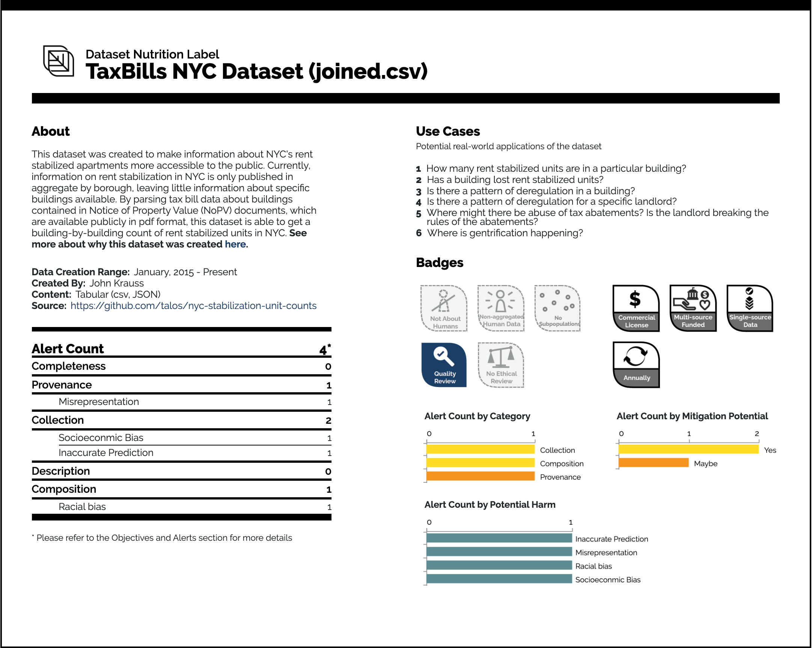
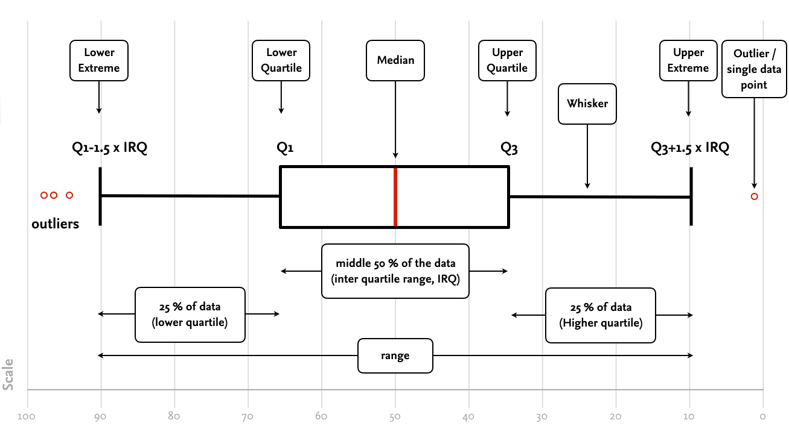

# Understanding your Data

By building on the Nested odel of Munzner [@munzner2014visualization], we have realized how important it is to understand the context of the data origin and the data at hand. In this chapter, we focus on the data, because many data viz project start with so-called ''found data''. These are data sets that are openly available on the internet, data sets in which creating you were not involved. The increasing use of data everywhere requires to think about data literacy, inclusion, and fairness to ensure that data creates value [@KoestenSimperl2021_dataUX]. However, data is often reused, thus, we need to reflect on where data has been created. Koesten & Simperl [@KoestenSimperl2021_dataUX] differentiate three main activities to interact with data: inspecting, engaging with the data, and placing data in context. 

Thus, in order to understand, whether data are valuable for your research question and which questions you can really tackle with these data, you need an understanding of its origin (the context of creation) and an understanding of its structure.   

## Understanding the Data Context

People's perception of what constitutes good-quality data changed as they engaged with the data. Koesten & Simperl [@KoestenSimperl2021_dataUX] highlight the importance of engagement around datasets, including discussions, feedback, reviews, ratings, and means to contact data creators. User communities and peer support can complement documentation efforts and make dataset maintenance sustainable. They, furthermore, propose the three activities:

1. Explore the environment of the dataset's creation (e.g., a study setup or the conditions surrounding data collection, with timeframes, geospatial boundaries, or configurations of collection devices).
2. Explore the norms of the discipline in which the data was collected, including methods of analysis and validation, as well as limitations (e.g., common margins of error). 
3. Connect data with the world, gauging how representative it is and reflecting on assumptions about how much it mirrors reality (includes also the question of what might be missing from the data.

Gebru et al. [@Gebruetal2018datasheets] propose ''datasheets'' inspired by more robust documentation standards in the electronics industry. Datasheets are meant to improve transparency and accountability of datasets and to be useful to both dataset creators and dataset consumers. 
For consumer of datasets, datasheets should encourage reflection on the process of creating, distributing, and maintaining a dataset (including benefits and harms). For dataset creators it helps also to reflect on the data and to make more informed decisions about its use. The authors offer guiding questions towards creating datasheets for datasets:

* Motivations: Describe the motivations for creating the dataset, including funding, any specific tasks the authors had in mind, and who the authors are.
* Composition: Describe the composition of the dataset, like what kinds of data are in it, how it was collected, whether labels are associated with the data, and whether the dataset contains sensitive information.
* Collection Process: Describe the data collection process, like how the data was collected, where or who is was collected from, who was involved in the collection process, and, if people are involved, if consent was given for the data to be collected.
* Processing: Whether the data was process or labelled and how it was done.
* Uses: The tasks the dataset is intended to be used for, how it has already been used, and limitations of use.
Distribution: How the dataset will be distributed and to who, and any restrictions on distribution.
* Maintenance: Who and how the dataset will be maintained, and if and how others will be able to build on it.

Building on this idea Holland et al. [@Hollandetal2018DatasetNutritionLabel] proposed the [dataset nutrion label](https://datanutrition.org/). An example is given in Fugure

```{r, out.width='100%', fig.align='center', fig.cap="Example of the Dataset Nutrion Label (first generation). Taken from https://datanutrition.org/", echo=FALSE}

```

## Understanding the Data Structure {#Understanding-the-Data-Structure}

<!-- Useful Ressources:
https://bookdown.org/ronsarafian/IntrotoDS/eda.html#summary-statistics
https://www.hcbravo.org/IntroDataSci/bookdown-notes/exploratory-data-analysis-summary-statistics.html
https://bookdown.org/BaktiSiregar/data-science-for-beginners/EDA.html
https://biosakshat.github.io/data-visualization.html
https://www.wekaleamstudios.co.uk/exploratory-data-analysis/
https://bolt.mph.ufl.edu/6050-6052/unit-1/
https://www.epa.gov/caddis-vol4/exploratory-data-analysis
https://medium.com/swlh/effective-visualization-of-multi-dimensional-data-a-hands-on-approach-b48f36a56ee8
-->

<!--NEXT TERM: CHANGE THE ORDERING: mean, distribution, variability - ask for both datasets questions, check if for the first part the second data set is more appropriate, and the other way around (or leave out outlier of the flight dataset) -->

In this section, we focus on understanding the structure of our data by employing the Exploratory Data Analysis (EDA). EDA is an approach of analyzing data sets to summarize their main characteristics by using data visualizations. In 1970 John Tukey [@Tukey1977eda] introduced EDA with this seminal book on this topic. He was an extraordinary scientist who had a profound impact on statistics and computer science^[I highly recommend reading more about him, for example in https://www.stat.berkeley.edu/~brill/Papers/life.pdf .]. Much of what we cover in EDA today is based on his work. Part of EDA is the so-called initial data analysis (IDA) (https://towardsdatascience.com/a-basic-guide-to-initial-and-exploratory-data-analysis-6d2577dfc242). IDA focuses on identifying data inconsistencies (e.g., missing values) and the description of the data properties; thus, EDA encompasses IDA. 

EDA allows the data analysts to achieve a richer qualitative understanding by ''looking at data to see what it seems to say''. Explorative Data Analysis should be understood as an iterative process that supports:
* the search for answers by visualizing, transforming, and modeling your data,
* the generation of hypotheses about what might be happening in a data set, and
* the refining of your analysis goals or the generation of additional goals.

This step should not be underestimated since data analysts spend much of their time (sometimes 80% or more) cleaning and formatting data to make it suitable for analysis, then actually carrying out the analysis.

EDA is based on three principles: (1) Continuous openness and re-expression, (2) Initial skepticism, and (3) Exploratory versus confirmatory. Rather than immediately imposing a model on the data that may obscure important details, EDA analysts try to find patterns in the data and describe them with simple summary statistics (descriptive statistics). It may take several iterations for the analyst to reach a satisfactory summary or ''smoothing'' of the data^[The so-called "smooth part of a data set" is the variability that the analyst has accounted for so far, while the "rough" part is the variability that remains unexplained.] Re-expressions or transformations of the data are essential for smoothing because they help the analyst identify new patterns.
Because EDA analysts assume that there is no uniquely correct numerical summary of a data set, they are very skeptical of initial numerical summaries. Numerical summaries and smoothings are constantly tested against the raw data to ensure that they adequately represent the data. To identify patterns and look for data points that do not fit the smooth part (outliers), EDA analysts rely heavily on visualization. 
By supporting data exploration, EDA helps researchers generate hypotheses. These hypotheses can later be tested with formal confirmatory procedures using inferential statistics.

<!-- ### Recap: Exploration vs. Confirmation -->
<!-- Erkläre mit den Wikipedia Artikel und dem Buch [@Christopher2017Statistics] -->

In summary, your goal during the EDA is to develop an understanding of your data. The easiest way to accomplish this is to use questions to guide your investigation. When you ask a question, the question focuses your attention on a particular part of your data set and helps you decide which graphs, models, or transformations to make.

<!-- Text von [@WickhamGrolemund2017Rfordatascience] -->
EDA is a creative process [@WickhamGrolemund2017Rfordatascience], thus the key to asking meaningful questions is to generate a large number of questions. Of course, it is very challenging to generate these questions at the beginning because you are not familiar with the dataset. On the other hand, each new question you ask will expose you to a new aspect of your data and increase your chance of discovery. You can quickly break down the most interesting parts of your data - and develop a thought-provoking set of questions - if you follow each question with a new question based on your findings. This challenge has been already formulated by Tukey:

> Far better an approximate answer to the right question, which is often vague, than an exact answer to the wrong question, 
> which can always be made precise. 
> --- John Tukey (The future of data analysis. Annals of Mathematical Statistics 33 (1), (1962), page 13)

There is no rule about what questions you should ask to guide your research. However, two types of questions will always be useful for making discoveries in your data. You can phrase these questions loosely as (1) What kind of variation occurs within my variables? and (2) What kind of co-variation occurs between my variables?

### Using R for Data Exploration

In the following, we address these two questions based on the example of Héctor Corrada Bravo from the EDA chapter of his course on [''Introduction to Data Science''](http://www.hcbravo.org/IntroDataSci/bookdown-notes/exploratory-data-analysis-visualization.html) from the Center for Bioinformatics and Computational Biology from the Univ. of Maryland. 

We employ the GNU R which is a widespread tool for statistical analysis. However, you can follow these steps with any programming language at hand. I would like to provide you an methodological understanding of how to explore data, rather than provide an introduction into R (http://www.r-project.org/) which is a GNU project, thus, R is Free Software under the terms of GPL. There are over 2,000 user-contributed packages available at R CRAN (https://cran.r-project.org/) with packages for specific functions or specific areas of study. It has an excellent integration with DBs (MySQL, SQLite) and automation based on scripts is easy. Furthermore, the graphical user interface RStudio (https://www.rstudio.com/) makes its usage very convenient. R is an interpreted language. It supports procedural programming with functions and, for some functions, object-oriented programming with generic functions. A generic function acts differently depending on the type of arguments passed to it, for example, R has a generic print() function that can print almost every type of object in R with a simple ''print(objectname)'' syntax. A Base R Cheat Sheet can be found [here](https://www.povertyactionlab.org/sites/default/files/r-cheat-sheet.pdf).

### Visualizing Data

In the following, we use the on-time data for all flights that departed NYC, i.e., JFK, LGA or EWR, in 2013. The Bureau of transportation statistics has released these data, and it was included into R. Let's get an overview about this dataset.

```{r chunk-label1, echo=TRUE, message=FALSE, warning=FALSE, paged.print=FALSE}
library(nycflights13)
library(skimr)

# Show the internal structure of the R object (= flights)
str(flights)

``` 

The first line shows the dimension of your data frame^[A dataframe is a list, with each component of that list being a equal length vector. Thus, intuitively, a dataframe is like a matrix with a rows-and-comlumns-structure. However, it differs from a matrix, since each column can having different mode (data type) [@Matloff2011ArtofRProgramming].], and then each of the columns (attributes) and show with their respective datatype.

Understanding the structure of the dataset is quite useful, since it allows you to get an overview on the available data types. A good understanding of the different data types is an important prerequisite for EDA, because you can use certain statistical measurements only for certain data types. You also need to know which data type you are dealing with in order to choose the right visualization method. Think of data types as a way to categorize different types of variables. We already discussed different types of variables in Section \@ref(sec:variabletype).

For setting up the pipeline it makes sense to work with a subset only, thus, we sample from the available data 10 percent. Furthermore, I decided to include only those observations that are complete. However, this decision should not be made carelessly. 

```{r chunk-label2, echo=TRUE, message=FALSE, warning=FALSE, paged.print=FALSE}
library(dplyr)

# Select a sample from the whole data set
fly.sample <- sample_frac(flights, .1) # takes a sample of 10 per cent

# dimensions of the data set
dim(fly.sample) 

# remove all observations that are not complete
fly.sample <- fly.sample[complete.cases(fly.sample), ]

# dimensions of the data set
dim(fly.sample)

```    


### Scatterplot

The next step is to get a first overview about the data, and for this, we can use a visualization already. For this I use a simple scatterplot.


```{r, chunk-label3, echo=TRUE, fig.dim = c(4, 3), fig.cap = "Scatterplot of delay times.", message=FALSE, warning=FALSE, paged.print=FALSE}

library(ggplot2)
library(tibble)

# Visualize Data 1 - Scatterplot
fly.viz1 <- rowid_to_column(fly.sample)
ggplot(fly.viz1, aes(x=rowid, y=dep_delay)) + geom_point() + 
  xlab("Flight ID") + ylab("Departure delay (in min)") 

```  

This is not very informative because this plot is not structured. However, let us reflect about the visualization for a moment. A scatterplot encodes two quantitative variables using both the vertical and horizontal spatial position channels., and the mark type is necessarily a point. They are highly effective for judging the correlation between two attributes. Scatterplots are often augmented with color coding to show an additional attribute. We talk about these characteristics in detail again.

Table: Characteristics of a scatterplot [@munzner2014visualization]

Idiom       | Scatterplot  
-------     | -------------  
What: Data  | Table: two quantitative value attributes.
How: Encode | Express values with horizontal and vertical spatial position and point marks
Why: Task   | Find trends, outliers, distribution, correlation; locate clusters.  
Scale       | Items: hundreds


Let's sort the values and change the graphical representation to make it easier to see.

```{r, chunk-label4, fig.dim = c(4, 3), fig.cap="Second scatterplot of delay times.", message=FALSE, warning=FALSE, echo=TRUE, paged.print=FALSE}

# Visualize Data - Scatterplot with ordered values

# 'arrange' sorts a variable, here dep_delay, in descending order
fly.viz2 <- arrange(fly.sample, fly.sample$dep_delay)

# create new column with row numbers
fly.viz2 <- rowid_to_column(fly.viz2)

ggplot(fly.viz2, aes(x=rowid, y=dep_delay)) + geom_point() + xlab("Ordered Flight ID") + ylab("Departure delay (in min)")  

```  

What do you think of this chart? What can you say about flight delay times now? In the following, we focus on the delays only, since many flights seems to be one time.

```{r fig.cap="Second scatterplot of delay times.", message=FALSE, warning=FALSE, chunk-label5, echo=TRUE, paged.print=FALSE}

# dimensions of the data set
dim(fly.sample)

# Remove all flights with no delay
fly.sample <- subset(fly.sample, dep_delay>0)

# dimensions of the data set
dim(fly.sample)

``` 


### Histogram

Let's now create a graphical summary of these variables. Let's start with a histogram. It divides the range of the dep_delay attribute into equal-sized bins and then plots the number of observations within each bin. What additional information does this new visualization give us about this variable?

The idiom of histograms shows the distribution of elements within an attribute. In the example, you can see a histogram of the weight distribution for all cats in a neighborhood, binned into 5-pound ranges. 

The visual coding of a histogram is very similar to bar charts, with a line marker. One difference is that histograms are sometimes displayed with no space between bars to visually imply continuity, while bar charts conversely have spaces between bars to imply discretization. Despite their visual similarity, histograms are very different from bar charts. They do not show the original data but aggregate it.

The number of bins in the histogram can be chosen independently of the number of elements in the data set. The choice of bin size is crucial and tricky: a histogram can look very different depending on the discretization chosen. One possible solution to the problem is to calculate the number of bins based on the features of the data set; another is to provide controls for the user to interactively change the number of bins and see how the histogram changes.

Table: Characteristics of a histogram [@munzner2014visualization]

Idiom         | Histogram  
-------       | -------------  
What: Data    | Table: one quantitative value attribute.
What: Derived | Derived table: one derived ordered key attribute (bin), one derived quantitative value attribute (item count per bin).
How: Encode   | Rectilinear Layout. Line mark with aligned position to express derived value attribute. Position: key attribute.


```{r, chunk-label6, echo=TRUE, fig.dim = c(4, 3), fig.cap = "Histogram of Delay Times.", message=FALSE, warning=FALSE, paged.print=FALSE}

# Visualize Data - Histogram
ggplot(fly.sample, aes(x=dep_delay)) + geom_histogram() +
  xlab("Departure delay (in min)") + ylab("Number of Flights")  

``` 

In the standard function the number of bins are 30, but of course, you can change them easily. The choice of binwidth significantly affects the resulting plot. Smaller binwidths can make the plot cluttered, but larger binwidths may obscure nuances in the data.

```{r, chunk-label7, echo=TRUE, fig.ncol = 2, fig.show="hold", out.width = "50%", fig.align = "center", fig.cap = "Histogram of Delay Times.", fig.subcap=c('(a)', '(b)', '(c)', '(d)'), message=FALSE, warning=FALSE, paged.print=FALSE}

#Change the size of the bins
ggplot(fly.sample, aes(x=dep_delay)) + geom_histogram(binwidth = 1)  +
  xlab("Departure delay (in min)") + ylab("Number of Flights")

ggplot(fly.sample, aes(x=dep_delay)) + geom_histogram(binwidth = 5)  +
  xlab("Departure delay (in min)") + ylab("Number of Flights")

ggplot(fly.sample, aes(x=dep_delay)) + geom_histogram(binwidth = 10) +
  xlab("Departure delay (in min)") + ylab("Number of Flights")

ggplot(fly.sample, aes(x=dep_delay)) + geom_histogram(binwidth = 15) +
  xlab("Departure delay (in min)") + ylab("Number of Flights")

``` 


### Density Plot

A Density Plot is a smoothed, continuous version of a histogram that visualizes the underlying probability distribution of the data by a continuous curve^[An excellent introduction in the usefulness of this method is given by Claus Wilke, check out  https://clauswilke.com/dataviz/histograms-density-plots.html]. The peaks of a Density Plot help display where values are concentrated over the interval. The most common form of estimation is known as [kernel density estimation](https://en.wikipedia.org/wiki/Kernel_density_estimation). In this method, a continuous curve (the kernel) is drawn at every individual data point and all of these curves are then added together to make a single smooth density estimation. The kernel most often used is a Gaussian (which produces a Gaussian bell curve at each data point). 

<!--A good explanation, how the density estimation works in general is given on [Wikipedia](https://en.wikipedia.org/wiki/Kernel_density_estimation#Example). -->

Just as is in the case with histograms, the exact visual appearance of a density plot depends on the kernel and bandwidth choices. In addition, the choice of the kernel affects the shape of the density curve.

```{r, chunk-label8, echo=TRUE, fig.dim = c(4, 3), fig.cap = "Density Plot of Delay Times.", message=FALSE, warning=FALSE, paged.print=FALSE}

# Visualize Data - Density Plot
ggplot(fly.viz2, aes(x=dep_delay)) + 
  geom_density(color="darkblue", fill="lightblue")  +
  xlab("Departure delay (in min)")

```


### Boxplot

Another alternative to display the distribution of a continuous variable broken down by a categorical variable is the Boxplot. The boxplot is an idiom presenting summary statistics for the distribution of a quantitative attribute, using five derived values (cp. Figure ??).

```{r, out.width='100%', fig.align='center', fig.cap="Properties of a Boxplot", echo=FALSE}

```

A box that extends from the *25th percentile* (lower quartile, Q1) of the distribution to the *75th percentile* (higher quartile, Q3), a distance called the *interquartile range* (IQR). In the center of the box is a line indicating the *median*, or 50th percentile, of the distribution. These three lines give you an idea of the spread of the distribution and whether the distribution is symmetrical about the median or skewed to one side. Furthermore, a line (or whisker) extending from each end of the box to the furthest non-outlier point (Q1-1.5 x IRQ and Q3+1.5 x IRQ) in the distribution which indicates the *range*. Visual points indicating observations that fall more than 1.5 times the IQR from each edge of the box. These outer points are unusual, so they are plotted individually. 

Boxplots are useful when we want to visualize many distributions at once and/or if we are primarily interested in overall shifts among the distributions.

Table: Characteristics of a boxplot [@munzner2014visualization]

Idiom        | Boxplot  
------       | -----------------  
What: Data   | Table: many quantitative value attributes.
What:Derived | Five quantitative attributes for each original attribute, representing its distribution.
Why: Task    | Characterize distribution; find others, extremes, averages; identify skew.  
How: Encode  | One glyph per original attribute expressing derived attribute values using vertical spatial position, with 1D list alignment of glyphs into separated with horizontal spatial position.
How: Reduce  | Item aggregation.
Scale       | Items: unlimited. Attributes: dozens.


```{r, chunk-label9, echo=TRUE, fig.dim = c(4, 3), fig.cap = "Boxplot of Delay Times.", message=FALSE, warning=FALSE, paged.print=FALSE}

# Visualize Data - Box Plot 
ggplot(fly.viz2, aes(x='',y=dep_delay)) + geom_boxplot()

```

```{r, chunk-label10, echo=TRUE, fig.dim = c(4, 3), fig.cap = "Boxplot of Delay Times (log scale).", message=FALSE, warning=FALSE, paged.print=FALSE}

# the function mutate() adds new variables and preserves existing ones
fly.viz2 <- mutate(fly.viz2, min_delay=min(fly.viz2$dep_delay, na.rm=TRUE)) 
fly.viz2 <- mutate(fly.viz2, log_dep_delay = log(fly.viz2$dep_delay - fly.viz2$min_delay)) 

# Visualize Data - Box Plot with log scale
ggplot(fly.viz2, aes(x='', y=log_dep_delay)) + geom_boxplot()

```

### Compare Distributions

Now we can start looking at the relationship between pairs of attributes. That is, how are each of the distributional properties we care about (central trend, spread and skew) of the values of an attribute changing based on the value of a different attribute. Suppose we want to see the relationship between departure delay time (a numeric variable), and the airport origin (a categorical variable).

```{r, chunk-label11, echo=TRUE, fig.dim = c(4, 3), fig.cap = "Multiple Boxplots of Delay Times depending on airport origine.", message=FALSE, warning=FALSE, paged.print=FALSE}

# Visualize Data - Box Plot in groups
ggplot(fly.viz2, aes(x=origin, y=log_dep_delay)) + geom_boxplot() +
  ylab("Delay Times (in min)")

```

### Summary Statistics

Let's continue our discussion of exploratory data analysis. In the previous section, we saw ways to visualize attributes (variables) using graphs to begin understanding the properties of the data distribution, an essential and preliminary step in data analysis. In this section, we begin discussing statistical or numerical summaries of data to quantify properties we have observed using visual summaries and plots. Remember that one purpose of EDA is to identify problems in data and understand variable properties. We also want to use EDA to understand the relationship between pairs of variables, such as their correlation or covariance.

We differentiate measures of central tendency, i.e., measures of location that describe a tendency of data to center about certain numerical value. Here we have mode, median, and mean. Then we have measures of variability, i.e., dispersion that describe the spread of the data across possible values. To this group the range, interquartile range, variance, and standard deviation belong to. Finally we have measures of shape that relate to the form of the distribution, its skewness. 

<!-- https://bookdown.org/yih_huynh/Guide-to-R-Book/diamonds.html -->

In this chapter, we use the diamond data set, that contains the prices, carat, color and other attributes of almost 54,000 diamonds. 

```{r, chunk-label12, echo=TRUE, fig.cap = "Diamonds Data Set.", message=FALSE, warning=FALSE, paged.print=FALSE}

#library(skimr)

# load dataset and show structure
data(diamonds)
# skim(diamonds)

# show attributes only
names(diamonds)

# count frequencies
table(diamonds$cut)

# counts proportions
prop.table(table(diamonds$cut))

```

<!-- Might be a better example: https://r4ds.had.co.nz/exploratory-data-analysis.html#patterns-and-models -->

Part of our goal is to understand how the variables are distributed in a given data set. Again, note that we are not using distribution in a formal mathematical (or probabilistic) sense. All the statements we make here are based on the data at hand, so we might call this an empirical distribution of data. Empirical is used here in the sense that it is data resulting from an experiment. Let's take a data set on the properties of diamonds as an example.

```{r, chunk-label13, echo=TRUE, fig.dim = c(4, 3), fig.cap = "Distribution of Depth in the Diamonds Data Set.", message=FALSE, warning=FALSE, paged.print=FALSE}

# dimensions of the data set
ggplot(diamonds, aes(x=depth)) + geom_histogram(bins=100)
```

### Central Tendency

Now that we know the area over which the data is distributed, we can figure out an initial summary of the data over that area. Let's start with the center of the data: 

The median is a statistic defined such that half of the data has a smaller value. We can use the notation `x(n/2)` (a rank statistic) to represent the median. 

Note that we can use an algorithm based on the quicksort partition scheme to compute the median in linear time (on average).

$\bar{x} = \frac{1}{n}\sum_{i=1}^{n} x_{i}$.

Where is the mean in our example dataset?

```{r, chunk-label14, echo=TRUE, fig.dim = c(4, 3), fig.cap = "Show Mean in Distribution of Depth in the Diamonds Data Set.", message=FALSE, warning=FALSE, paged.print=FALSE}

# determine median
ggplot(diamonds, aes(x=depth)) + geom_histogram(bins=100) + geom_vline(aes(xintercept=median(depth)), color="red")

```

Now that we have a measure of the center, we can now discuss how the data is distributed around that center.

### Median, and IQR

Median is better measure of central tendency than the mean when we have outliers or/and skewed distribution, e.g., income, housing prices, waiting time. It is the middle observation when data is sorted in the order of magnitude. Thus (about) 50 % of observations are smaller and (about) 50 % are larger than the median. In our dataset:

```{r, chunk-label15, echo=TRUE, fig.dim = c(4, 3), fig.cap = "Median, median and range in Distribution of Depth in the Diamonds Data Set.", message=FALSE, warning=FALSE, paged.print=FALSE}

# min and max value
summarize(diamonds, min_depth = min(diamonds$depth), max_depth = max(diamonds$depth))

# mean vs. median
summarize(diamonds, mean_depth = mean(diamonds$depth), median_depth = median(diamonds$depth))
```

For the mean, we have a convenient way to describe this: the average distance (using the squared difference) from the mean. We call this the variance of the data. vhe Variance is a commonly used statistic for dispersion, but it has the disadvantage that its units are not easily conceptualized (e.g., squared diamond depth).

$sd(x) = \frac{1}{n} \sum_{i-1}^n (x_i-\bar{x})^2$

A scatter statistic that is in the same units as the data is the standard deviation, which is just the square root of the variance:

$var(x) = \sqrt{\frac{1}{n} \sum_{i-1}^n (x_i-\bar{x})^2}$

We can also use standard deviations as an interpretable unit for how far a particular data point is from the mean. This is often use in tables. 

Just like we saw how the median is a rank statistic used to describe central tendency, we can also use rank statistics to describe spread. 
For this we use two more rank statistics: the first and third quartiles, x(n/4) and x(3n/4) respectively. We know this already, it is the interquartile range. Also called midspread and is the difference between third and first quartiles (spread in the middle 50%).
It is not affected by extreme values.

```{r, chunk-label16, echo=TRUE, fig.dim = c(4, 3), fig.cap = "Rang, Variance and Standard Deviation of Depth in the Diamonds Data Set.", message=FALSE, warning=FALSE, paged.print=FALSE}

# Rang
range(diamonds$depth)

# Variance
var(diamonds$depth)

#standard deviation
sd(diamonds$depth)
```

### Outliers

There is no precise way to define and identify outliers. Instead, a subject matter expert must interpret the raw observations and decide whether or not a value is an outlier. 

```{r, chunk-label17, echo=TRUE, fig.dim = c(4, 3), fig.cap = "Outlier of Depth in the Diamonds Data Set.", message=FALSE, warning=FALSE, paged.print=FALSE}

library(outliers)

# Determine outlier (Finds value with largest difference between it and sample mean, which can be an outlier.)
outlier(diamonds$depth)

```

However, we can use estimates of dispersion to identify outlier values in a data set. If we make an estimate of dispersion based on the techniques we have just seen, we can identify values that are unusually far from the center of the distribution. Although this method works relatively well in practice, it presents a fundamental problem. Severe outliers can significantly affect standard deviation-based spread estimates. In particular, the spread estimates are inflated in the presence of severe outliers. To circumvent this problem, we use rank-based spread estimates to identify outliers as such:
$outliers_{sd}(x)= \{x_i||x_j|>\bar{x}+k \times sd(x)\}$

To mitigate the effect of severe outliers you can use rank-based estimates of spread to identify outliers as:

$\mbox{outliers}_{IQR}(x)= \{x_j|x_j < x_{(1/4)} - k \times IQR(x) \mbox{ or } x_j > x_{(3/4)} + k \times IQR(x) \}$

This is usually referred to as the Tukey outlier rule, where the multiplier k plays the same role as before. We use IQR here because it is less prone to inflating due to severe outliers in the data set. It also works better for skewed data than the standard deviation based method.

```{r chunk-label17a, fig.dim = c(4, 3), echo=FALSE, fig.cap="Spread of Depth in the Diamonds Data Set.", message=FALSE, warning=FALSE, paged.print=FALSE}

# Outliers (based on IQR)
outlier_df <- diamonds %>%
  summarize(q1=quantile(depth, 1/4), q3=quantile(depth, 3/4), iqr=IQR(depth)) %>%
  slice(rep(1, 2)) %>%
  mutate(multiplier = c(1.5, 3)) %>%
  mutate(lower_outlier_limit = q1 - multiplier * iqr) %>%
  mutate(upper_outlier_limit = q3 + multiplier * iqr)

diamonds %>%
  ggplot(aes(x=depth)) +
  geom_histogram(bins=100) +
  geom_vline(aes(xintercept=lower_outlier_limit), data=outlier_df, color="red") +
  geom_vline(aes(xintercept=upper_outlier_limit), data=outlier_df, color="red")
```

When does it make sense to remove outliers?
<!-- taken from https://statisticsbyjim.com/basics/remove-outliers/ -->

Well, it depends. As you can see in this visualization, removing outliers can distort your analyses by removing important information from the dataset. However, you have to make an informed decision what to do with them because removing outliers is legitimate only for specific reasons. Outliers can provide very interesting information about the subject-area and data collection process. It’s essential to understand how outliers occur and whether they might happen again as a normal part of the process or study area. You might be tempted to simply  remove outliers to decrease the variability in your data and therefore the increases statistical power, which makes your results to become statistically significant. These temptation might be a reason for the reproducibility crisis in psychology and other disciplines.
<!-- hypothesis! please check out -->

### Skewness

One final thought. Although there are formal ways to define this precisely, the five-number summary can be used to understand if data are biased. How? 

If one of these differences is larger than the other, then it suggests that this data set may be skewed, meaning that the range of data on one side of the median is longer (or shorter) than the range of data on the other side of the median. Do you think our diamond depth data set is biased?

```{r, chunk-label18, echo=TRUE, fig.dim = c(4, 3), fig.cap = "Summary Statistics of Depth in the Diamonds Data Set.", message=FALSE, warning=FALSE, paged.print=FALSE}

library(moments)

# Summary statistics
summary(diamonds$depth)

# Skewness
skewness(diamonds$depth)

```

The skewness of the data is negative, thus, we can conclude that the data are close to bell shape but slightly skewed to the left. 


For pairs of continuous variables, the most useful visualization is the scatter plot. This gives an idea of how a variable varies (in terms of central trend, variance and skewness) depending on another variable. A scatter plot can be used to show relationship between `price` and `carrat`.


```{r, chunk-label11-1, echo=TRUE, fig.dim = c(4, 3), fig.cap = "Scatterplot of Price Depending On Carat", message=FALSE, warning=FALSE, paged.print=FALSE}

# Visualize Data - Scatterplot
ggplot(diamonds, aes(x=price, y=carat)) + geom_point()

```

As we expected, there seem to be a relationsship between price and carrat, which brings us to the next question. 


### Covariance and Correlation
<!-- https://bookdown.org/ronsarafian/IntrotoDS/eda.html#summary-statistics 
http://lipas.uwasa.fi/~sjp/Teaching/Bs/Lectures/BasicStatistics.html -->

As you have learned, the scatterplot is a visual method for observing relationships between pairs of variables. 

```{r, chunk-label19, echo=TRUE, fig.dim = c(4, 3), fig.cap = "Covariance and correlation.", message=FALSE, warning=FALSE, paged.print=FALSE}

# Covariance and correlation
diamonds %>%
  ggplot(aes(x=carat, y=price)) +
  geom_point() +
  geom_hline(aes(yintercept = mean(price)), color="blue", lty=2) +
  geom_vline(aes(xintercept = mean(carat)), color="blue", lty=2)
```

However, how do we quantitatively summarize the relationship between two variables. We need to extend our notion of scatter (or variation of data around the mean) to the notion of covariation: do pairs of variables vary around the mean in the same way or more precisly, does x~i vary in the same direction and on the same scale away from its mean as y~i? 

This leads to covariance:
$cov(x,y) =\frac{1}{n}\sum_{i=1}^{n}(x_i - \bar{x})(y_i -\bar{y})$

Correlation (formally, Pearson’s correlation coefficient) summarizes the same relationship in a unit-less way:

$cor(x,y)=\frac{cov(x,y)}{sd(x)sd(y)}$ 

Correlation evaluates the direction as well as strength of a relationship between continuous variables. The correlation coefficient can range from -1 to +1, which signifies strong negative to strong positive relation between the variables. 

You can think of the correlation as the covariance between x and y after transforming each to the unitless scale of z-scores. Just to recall, a z-score of a sample x is defined as the mean-centered, scale normalized observations: $z_i(x)=\frac{x_i-\bar{x}}{sd(x)}$, thus $r(x,y)=cov(z(x),z(y))$. 

### Correlation Matrix
<!--https://rkabacoff.github.io/datavis/Models.html
https://www.displayr.com/what-is-a-correlation-matrix/ 
https://bookdown.org/ronsarafian/IntrotoDS/eda.html#summary-statistics-->

The covariance is a simple summary of association between two variables, but it certainly may not capture the whole “story” when dealing with more than two variables. The most common summary of multivariate relation, is the covariance matrix, but we warn that only the simplest multivariate relations are fully summarized by this matrix.

```{r, chunk-label20, echo=TRUE, fig.dim = c(4, 3), fig.cap = "Correlation Matrix.", message=FALSE, warning=FALSE, paged.print=FALSE}

# Correlation Matrix (less meaningful example - just a showcase)

diamonds_corr <- cor(diamonds[,c(1,5,6,7)])

# Print mcor and round to 2 digits
round(diamonds_corr, digits=2)

# Load visualization from package
library(corrplot)
corrplot(diamonds_corr)
```

## General Guidelines for EDA


It is difficult to say, what the best process is in EDA. I just provided a number of analyses and possible visualizations. You find many alternative suggestions, and I provide one of them:

* Begin with a discussion of the “center” of the data, generally based on mean.
* Describes how data are distributed. 
* Follow with a discussion of variability (and of skew if appropriate).
* End with a summary evaluation which may have a subjective component (numbers must be interpreted, they don’t speak for themselves).
* Make sure to use numbers in a description wisely – not too few or too many.

However, each dataset is very special, thus, as often it stays to be an individualized process. Therefore, reproducibility is very important during EDA. Computational notebooks such as R Markdown (used here), but also Jupyter notebooks (used in our exercise), Observable (google product) support readability and understandability of your exploration process. This supports [Knuth’s vision of literate programming](https://en.wikipedia.org/wiki/Literate_programming).

## Tools and Libraries for Data Exploration

Besides GNY R there are many tools and libraries that support the process of data exploration. In this section, I provide a selection. 

<!-- create table with tools -->

Wrangler provides data-transformation scripts within a visual, direct manipulation interface augmented by predictive models [@kandel2011wrangler]. Wrangler is an interactive system for creating data transformations. It uses semantic data types, such as geographic locations, dates, classification  codes to support the validation of data and the type conversion. Interactive histories support review, refinement, and annotation of transformation scripts. The researchers provide a WebApp but also a [commercial product](https://www.trifacta.com/start-wrangling/). 

A similar approach is realized by [Open Refine](https://openrefine.org/). This tool was formerly developed by Google but it is now maintained by the open source community. It allows you to clean data, transform it from one format into another, or extend you data by additional data from an API. 

Besides DataWrangler, I would like to mention the tool Voyager [@wongsuphasawat2015voyager]. The Voyager system is specifically suitable for exploratory visual analysis. You can again test it via a [WebApp](https://vega.github.io/voyager/) and the source code is available on [Github](https://github.com/vega/voyager). And for the sake of completeness, there is also a commercial software [Tableau](https://www.tableau.com/), which can be freely used in the educational context.

Both, Data Wrangler and Voyager are using a formal language - the Vega-Lite visualization grammar. Vega-Lite is a high-level grammar of interactive graphics that provides a concise, declarative JSON syntax to create diagrams for data analysis and presentation. Vega-Lite specifications describe visualizations as ``encoding mappings'' from data to properties of graphical marks (e.g., points or bars). 

The Vega-Lite compiler automatically produces visualization components including axes, legends, and scales. Vega-Lite supports both data transformations (e.g., aggregation, binning, filtering, sorting) and visual transformations (e.g., stacking and faceting). Moreover, Vega-Lite specifications can be composed into layered and multi-view displays, and made interactive with selections as you can see in the example. 

Vega-Lite is being used in another interesting library. On top of the Vega-Lite JSON specification a simple API was built: Altair. It is a declarative statistical visualization library for Python. [Source code](https://github.com/altair-viz/altair) and a comprehensive [documentation](https://altair-viz.github.io/) as well as [Tutorial Notebooks](github.com/altair-viz/altair_notebooks) are available on Github.


<!--  In der Wahrscheinlichkeitstheorie betrachten wir einen zugrundeliegenden Prozess, der eine gewisse Zufälligkeit oder Unsicherheit aufweist, die durch Zufallsvariablen modelliert wird, und wir finden heraus, was passiert. 

In der Statistik beobachten wir etwas, das passiert ist, und versuchen herauszufinden, welcher zugrunde liegende Prozess diese Beobachtungen erklären würde.

Statistik ist eng mit der Wahrscheinlichkeitstheorie verbunden. Mit Hilfe der Statistik können Sie die Wahrscheinlichkeit, die Chance, dass ein bestimmtes Ereignis eintritt, ausrechnen: Wenn Sie wissen wollen, wie hoch die Wahrscheinlichkeit ist, dass Ihr Ferienflugzeug abstürzt, denken Sie daran, wie viele Flugzeuge in der Regel innerhalb eines Jahres abstürzen. Da diese Zahl sehr klein ist, folgern Sie, dass die Wahrscheinlichkeit, dass Ihr Flugzeug abstürzt, ebenfalls gering ist. Sie haben eine sehr einfache statistische Analyse der Daten über Flugzeugabstürze durchgeführt und daraus eine Wahrscheinlichkeit berechnet.

Aber die Dinge funktionieren auch umgekehrt: Sie können abstrakte Wahrscheinlichkeiten verwenden, um Ihnen bei Ihren Statistiken zu helfen. Sagen Sie zum Beispiel, Sie wollen testen, ob ein Würfel, der in einem Casino verwendet wird, fair ist. Dazu werfen Sie den Würfel sehr oft und zeichnen die Ergebnisse auf. Dann argumentieren Sie wie folgt: Wenn der Würfel fair ist, dann sollte jede Zahl gleich wahrscheinlich sein. Es gibt sechs Zahlen, also sollte jede Zahl in 1/6 der Fälle auftauchen. Sie vergleichen den tatsächlichen Würfel mit einem idealen Würfel: Wenn Ihr Casinowürfel Ihnen in etwa 1/6 aller Würfe jede Zahl liefert, entscheiden Sie, dass es fair ist.

Die Wahrscheinlichkeitstheorie ist wichtig, wenn es um die Auswertung von Statistiken geht. Wenn Sie in einer Meinungsumfrage feststellen, dass 80% der Befragten den derzeitigen Premierminister mögen, ist die Versuchung groß, daraus zu schließen, dass der Premierminister sehr beliebt ist. Aber woher wissen Sie, dass Ihr Ergebnis nicht nur zufällig zustande gekommen ist? Nun, Sie verwenden die Wahrscheinlichkeitstheorie, um die Wahrscheinlichkeit zu berechnen, dass Ihr Ergebnis zufällig zustande gekommen ist - wenn diese Wahrscheinlichkeit sehr gering ist, dann sollten Sie zu dem Schluss kommen, dass der Premierminister sehr beliebt ist.

Statistics is the branch of mathematics that transforms data into useful information for decision makers

Statistics is the art of understanding and learning from data

Involves
Collecting data
Presenting and describing data
Analyzing and interpreting data

Data are facts that we consider worth collecting, summarizing, analyzing, and interpreting

Data sets are data collected for a particular study or analysis

Unit of analysis is a person, thing, transaction, or event that can be separately and uniquely identified and about which we want to collect data
Person (student, customer, programmer, ...)
Thing (education, power plant, ...)
Transaction (sale, cost of a software license, monthly rent, ...)
Event (application, election)

Variable is a characteristic, an attribute, or an occurrence observed for each unit of analysis

Examples
Unit of analysis: a computer science student
Variables: gender, age, studentID

-->


