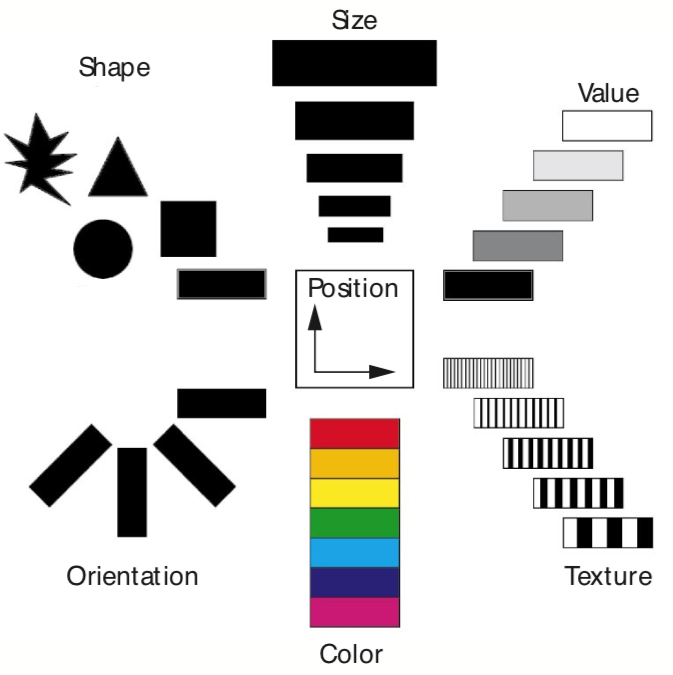

# Human Perception and Visual Encoding

As we have discussed on the previous chapters, an important first step in data visualization is to contextualize your data. The next step is to select - based on the data characteristics - an effective visual encoding. Such visual encoding maps the data values to graphical features such as position, size, shape, and color. However, such mapping is not as straightforward as one might assume. A prerequisite is to understand how we, as humans, perceive our world, or more specifically visualizations. Ware states in his book [@ware2019information]: ''Understanding human perception can significantly improve both the quality and the quantity of information being displayed.'' Such understanding allows us to design visualizations that can replace demanding cognitive calculations with simple perceptual inferences which often improve interpretability & comprehension and, therefore, decision making [@Heer_Bostock_Ogievetsky_2010].

## Human Perception

Human perception is the ability to perceive our surroundings through the light that enters the eyes. The eye convert light into a series of electrochemical signals that are transmitted to the brain. This process can take as little as 13 milliseconds, according to a 2017 study by MIT in the United States [@munzner2014visualization]. However, human vision has a number of physical and perceptual limitations (concerning colors, patterns, and structures), which we should be aware of in order to create more effective data visualizations.

We can roughly divide perception into two stages [@Few2004showmenumbers]. The sensations is the physical reception of the stimulus from the outside world, and the perception is a cognitive process that relates to the processing and interpretation of that stimulus. On the one hand the physical properties of the eye and the visual system mean that there are certain things that cannot be seen by the human; on the other hand, the interpretative capabilities of visual processing allow images to be constructed from incomplete information. 

We need to understand both stages as both influence what can and cannot be perceived visually by a human being, which in turn directly affects the way that we design visualizations. 

We begin with looking at the eye as a physical receptor, and then go on to consider the processing involved in basic vision.

### The Human Eye

Vision begins with light which is reflected from objects in the world. This light catches the eye and the image of these objects is projected upside down on the back of the eye, on the retina (this you might remember from school). In the following, we look into these components in more detail (cp. Figure XX). 

<!--https://upload.wikimedia.org/wikipedia/commons/f/f5/Human_eye_diagram-sagittal_view-NEI.jpg -->
```{r, out.width='50%', fig.align='center', fig.cap="Components of the Human Eye, National Eye Institute. Taken from Wikipedia Commons", echo=FALSE}
knitr::include_graphics("images/humaneye.jpg")
```

At the front of the eye are the cornea and lens which focus the light into a sharp image on the retina. The retina is the the light-sensitive layer of the eye. In a person with normal vision, the lens focuses images perfectly on a small depression in the back of the eye called the fovea (in German Sehgrube), which is part of the retina.

The retina contains two types of photoreceptor (light-sensitive cells): rods for low-light vision and cones for color vision. 

Rods are highly sensitive to light and therefore allow us to see under a low level of lightning. However, they are unable to resolve fine detail and are subject to light saturation. This is the reason for the temporary blindness we get when moving from a darkened room into sunlight: the rods have been active and are saturated by the sudden light. As you can imagine, nowadays in our industrialized world, rods are hardly used [@Johnson2014designingwiththemind]. There are approximately 120 million rods per eye which are mainly situated towards the edges of the retina. Rods therefore dominate peripheral vision.

The cones are specialized types of photoreceptors that work best in bright light conditions. Cones are very sensitive to acute detail and provide tremendous spatial resolution. They are also directly involved in our ability to perceive color. The eye has approximately 6 million cones, mainly concentrated on the fovea. We can differentiate three types of cones. Each type of cone is sensitive to a range of light frequencies, and these sensitivity ranges overlap considerably [@Johnson2014designingwiththemind].


<!-- - Low frequency: these cones are sensitive to light over almost the entire range of visible light, but are most sensitive to the middle (yellow) and low (red) frequencies.
- Medium frequency: these cones respond to light ranging from the high-frequency blues through the lower middle-frequency yellows and oranges. Over- all, they are less sensitive than the low-frequency cones.
- High frequency: these cones are most sensitive to light at the upper end of the visible light spectrum—violets and blues—but they also respond weakly to middle frequencies, such as green. These cones are much less sensitive overall than the other two types of cones, and also less numerous. One result is that our eyes are much less sensitive to blues and violets than to other colors. 

Given the odd relationships among the sensitivities of our three types of retinal cone cells, one might wonder how the brain combines the signals from the cones to allow us to see a broad range of colors.
The answer is by subtraction. Neurons in the visual cortex at the back of our brain subtract the signals coming over the optic nerves from the medium- and low- frequency cones, producing a red–green difference signal channel. Other neurons in the visual cortex subtract the signals from the high- and low-frequency cones, yielding a yellow–blue difference signal channel. A third group of neurons in the visual cortex adds the signals coming from the low- and medium-frequency cones to produce an overall luminance (or black–white) signal channel.2 These three channels are called color-opponent channels.
The brain then applies additional subtractive processes to all three color-opponent channels: signals coming from a given area of the retina are effectively subtracted from similar signals coming from nearby areas of the retina.-->

Although the retina is mainly covered with photoreceptors there is one blind spot where the optic nerve enters the eye. The blind spot has no rods or cones, yet our visual system compensates for this so that in normal circumstances we are unaware of it.

The retina also has specialized nerve cells called ganglion cells. There are two types: X-cells, which are concentrated in the fovea and are responsible for the early detection of pattern; and Y-cells which are more widely distributed in the retina and are responsible for the early detection of movement. The distribution of these cells means that, while we may not be able to detect changes in pattern in peripheral vision, we can perceive movement.


### Color Vision

We can describe color by different color space presentation. The RGB is the most popular one. However, in 1970, computer graphics researchers developed a model that closely aligns with the way human vision perceives color: the HSL (for hue, saturation, lightness) model. Hue is described in units of degree starting from 0 (red) to 360º.These are the typical colors you know. Saturation measures the degree to which a particular hue fully exhibits its essence. It goes from 0 % (grey) to 100% (very colorful). Lightness (or brightness) measures the degree to which color appears dark or light ranging from 0% (black) to fully 100% (white). To convert your colors, you can use webpages such as [ConvertColor](https://convertacolor.com/) or libraries such as 'colorspace' in GNU R [@Zeileisetal2019colorspace]. All HCL-based color palettes are also provided as discrete, continuous, and binned color scales for the use with the ggplot2 package [@Wickham2016ggplot2).

```{r chunk-label4-1, echo=TRUE, message=FALSE, warning=FALSE, paged.print=FALSE}
library("colorspace")

hcl_palettes(plot = TRUE)

``` 

However, our color vision is limited [@Johnson2014designingwiththemind]. Our visual system is much more sensitive to differences in color and brightness, i.e., to contrasting colors and edges, than to absolute brightness levels. We perceive colors not in absolute terms (see three types of cones) but as the difference between the color we are focusing on and the color that surrounds it [@Few2009nowtoseeit]. Our vision is therefore heavily impacted by the context.

There are three factors that affect our ability to distinguish colors from each other [@Johnson2014designingwiththemind]. First, the paler (less saturated) two colors are, the harder it is to tell them apart. Second, the the smaller or thinner objects are, the harder it is to distinguish their colors. Text is often thin, so the exact color of text is often hard to determine. Finally, the more separated color patches are, the more difficult it is to distinguish their colors, especially if the separation is great enough to require eye motion between patches.

But there are also external factors that influence how we can distinguish colors. Those factors are among others: the variation among color displays, gray-scale displays, display angle, and ambient lighting. These external factors are usually beyond your control but you should keep them in mind. Colors that appear distinguishable on your screen may not be so distinguishable in some of the environments in which the software is used.

<!-- https://thenode.biologists.com/data-visualization-with-flying-colors/research/ -->
A last issue you should consider is color blindness. Actual this term is mislabeled. It is not blindness, but rather a lack of color vision. It is the inability (or sometimes diminished ability) to see certain colors or perceive color contrasts in normal light. Color blindness is usually genetic, but in some cases it can be caused by disease or age. Furthermore, one in 12 men is color blind, compared to one in 200 women. The most common form of color blindness is red/green color blindness (protanopia). There are other, less common forms of color blindness that also involve different color pairs but also rare forms where colors can not be distinguished at all (achromatopsia). 

To avoid that people cannot interpret your data visualizations correctly, you should use services such as [ColorBrewer](https://colorbrewer2.org). It supports you to select an appropriate color scheme by considering various user-selected criteria, including colorblind-friendliness. 


### Spation Vision

The spatial resolution of the human visual field drops greatly from the center to the edges. In the center 1% of your visual field, i.e., the fovea, you have a high-resolution TIFF, and everywhere else, you have only a low-resolution JPEG. There are three reasons for this [@Johnson2014designingwiththemind]:

- Pixel density. Each eye has 6 to 7 million retinal cone cells. They are packed much more tightly in the fovea. The fovea has about 158,000 cone cells in each square millimeter. The rest of the retina has only 9,000 cone cells per square millimeter.
- Data compression. Cone cells in the fovea connect 1:1 to the ganglial neuron cells that begin the processing and transmission of visual data, while elsewhere on the retina, multiple photoreceptor cells (cones and rods) connect to each ganglion cell. In technical terms, information from the visual periphery is compressed (with data loss) before transmission to the brain, while information from the fovea is not.
- Processing resources. The fovea is only about 1% of the retina, but the brain’s visual cortex devotes about 50% of its area to input from the fovea. The other half of the visual cortex processes data from the remaining 99% of the retina.

The result is that our vision has much, much greater resolution in the center of our visual field than elsewhere. If our peripheral vision has such low resolution, why do we see our surroundings sharply and clearly?

We experience this illusion because our eyes move rapidly and constantly about three times per second even when we don’t realize it, focusing our fovea on selected pieces of our environment. Our brain fills in the rest in a gross, impressionistic way based on what we know and expect. Our brain does not have to maintain a high-resolution mental model of our environment because it can order the eyes to sample and resample details in the environment as needed. We need this insights when we talk in the Chapter Interaction (Section \@ref(sec:interaction)).


<!-- https://www.interaction-design.org/literature/article/preattentive-visual-properties-and-how-to-use-them-in-information-visualization -->
## Pre-Attentive Processing

Many visual channels provide pre-attentive processing, where a distinct item stands out from many others immediately. The great value of preattentive processing is that the time it takes us to detect the different object does not depend on the number of distractor objects. Our low-level visual system performs massive parallel processing on these visual channels without requiring the viewer to consciously pay direct attention to the individual elements. Pre-attentive processing occurs for many channels. Examples are tilt, size, shape, proximity, and even shadow direction, but also various types of motion such as flicker, motion direction, and motion speed. However, a small number of potential channels do not support pre-attentive processing. One example is parallelism. Most visual channel pairs do not support pre-attentive processing, but some pairs do: one example is space and hue, and another is motion and shape. Pre-attentive processing is definitely not possible with three or more channels.  

A question is, how we can systematically approach pre-attentive processing. Two principles can guide the use of visual channels in visual encoding: expressiveness and effectiveness. A set of facts that is *expressible* in a visual language if the sentences (i.e. the visualizations) in the language express all the facts in the set of data, and only the facts in the data. A visualization is more *effective* than another visualization if the information conveyed by one visualization is more readily perceived than the information in the other visualization.

The expressiveness principle dictates that the visual encoding should express all of, and only, the information that the dataset exhibits. For example, ordered data (nominal) should be shown in a way that our perceptual system intrinsically senses as ordered and unordered data (ordinal) should not be shown in a way that perceptually implies an ordering. The expressiveness principle is especially important, wenn we talk about ethics in data visualization (Section \@ref(sec:ethics))

The effectiveness principle dictates that the importance of the attribute should match the salience of the channel, i.e. its noticeability. We already talked about colors but there are more visual channels we can consider when we decide about the visual encoding. The first researcher who thought about the effectiveness of visualizations is [Jacques Bertin](https://en.wikipedia.org/wiki/Jacques_Bertin).

<!-- https://graphworkflow.com/retinal/ -->
<!-- Check out: A Survey of Perception-Based Visualization Studies by Task -->
### Choice of Encoding - Bertin’s Guidance

In 1967, Jacques Bertin published the book "Semiologie Graphique" (in English "Semiology of Graphics") that was based on his long-standing experience as a cartographer and geographer. In this book, Bertin linked human perception to visualization. Even though, this linking was more based on intuition than vision research, Bertin's experiences were later empirically proven. Bertin's key concept is the image, which is is the fundamental perceptual unit of a visualization. An ideal visualizations will contain only a single image in order to optimize “efficiency,” the speed with which observer can extract the information.

Bertin identified in his work that every visualization is made by a series of basic components that have different expressive power and that each one works best only in some conditions. In general, the encoding of data can be done in a coordinate system with the cartesian coordinate system as its most prominent representative. Of course, there are further coordinate systems, such as geographical coordinate system, parallel coordinates system, polar coordinate system, or the network coordinate system. Based on the chosen coordinate system, you need to place your data, more precisely your data values (e.g., items, links) into these coordinates. For this, you can differentiate so-called *marks*. A mark is a basic graphical element which can be classified according to the number of spatial dimensions they require [@munzner2014visualization]: Possible dimensions are: a zero-dimensional (0D) mark is a point, a one-dimensional (1D) mark is a line, a two-dimensional (2D) mark is an area, a three- dimensional (3D) mark defines a volume.

```{r, out.width='50%', fig.align='center', fig.cap="Bertin’s Visual Channels Taken from McDonald (1999).)", echo=FALSE}

```

A visual channel defines the appearance of *marks* (points, lines, areas), independent its dimensionality. Bertin differentiated six visual channels: size, value, texture, color, orientation, shape. For each of these channels he pointed out in what cases they work best and how to use them (cp. Figure XX, redrawn from [@MacDonald1999usingcolor]). We already discussed that the human eye is independently sensitive to these visual channels, which means that more than one visual channel can be deployed at the same time in order to encode different variation in the data. 

<!-- https://graphworkflow.com/retinal/ -->
These visual channels can represent different relationships between marks:

- association ($\equiv$): the marks an be perceived as similar (*group*),
- selection ($\ncong$): the marks are perceived as different, forming families (*distinguish*),
- order ($O$): the marks are perceived as ordered (*sort*), and
- quantity ($Q$): the marks are perceived as proportional to each other (*count*).

These perceptional properties can be arranged into the levels of organization [@green1998toward]. Associative perception is the lowest level of organization. It allows grouping all elements of a variable in spite of different values. ''Selective perception'' is the next higher level (flip side of association). It permits the viewer to select one category of a component, perceive locations of objects in that category and ignore others. Order allows the data to be ordinally ranked. An observer can see that one value of a variable represents a larger or smaller quantity than another. Quantity permits direct extraction of ratios, without need of consulting a legend, etc.

As said, Bertin's research has been empirically substantiated. Most notable are perhaps Cleveland and McGill’s controlled experiments [@ClevelandMcGill1984graphicalperception]. The most important findings is that they mapped human response directly to visually encoded abstract information and provide explicit rankings of perceptual accuracy for each channel type.

<!-- Cleveland and McGill's experiments on magnitude channels showed that aligned position against a common scale is perceived most accurately, followed by unaligned position against an identical scale, followed by length, followed by angle. Area rankings are much less accurate than all others. They also suggest rankings for channels they have not directly tested: After area is an equivalence class of volume, curvature, and luminance; this class is followed by a hue in first place. (This last-place ranking is for hue as a magnitude channel, a very different matter from its second-place ranking as an identity channel). Cleveland and McGill's use their insights for redesigning existing graphs. -->

Based on this work, Mackinlay [@Mackinlay1986automatingdesign] has derived perceptually-motivated rankings of the effectiveness of variables such as position, length, area, and color for encoding quantitative data. Heer and Bostock [@HeerBostock2010crowdsourcing] confirmed and extended this work through crowdsourcing. The only discrepancy is that the later research found length and angle judgments that are roughly equivalent.

```{r, out.width='50%', fig.align='center', fig.cap="Results of Psychophysical power law of Stevens. Taken from Munzner (2014).)", echo=FALSE}
knitr::include_graphics("images/stevens_psychophysicalpowerlaw.png")
```

Their results for visual encodings agree well with psychophysical channel measurements. Psychophysics is devoted to the systematic measurement of general human perception [@StevensMarks2017Psychophysics]. We perceive different visual channels with different degrees of accuracy; they are not all equally distinguishable. Our responses to the sensory experience of size can be characterized by power-law/power-law, where the exponent depends on the precise sensory modality: Most stimuli are magnified or compressed; few remain unchanged. The diagram in Figure XX shows that length has an exponent of n = 1.0, so our perception of length is very close to the true value. Length means the length of a line segment on a 2D plane perpendicular to the observer. The other visual channels are not perceived as accurately: Area and brightness are compressed, while color saturation or electroshocks are magnified. 

## Combining Channels

Multiple visual channels can be combined to redundantly encode the same attribute. The limitation of this approach is that more channels are ''consumed'' so not as many attributes can be encoded in total, but the advantage is that the attributes represented are very well perceived. 

However, visual channels are not completely independent of each other, since some have dependencies and interactions with others [@munzner2014visualization]. You must consider a continuum of potential interactions between channels for each pair, ranging from orthogonal and independent separable channels to inseparably combined integrated channels. Visual encoding is straightforward for single channels, but attempts to encode different information in integrated channels will fail. People will not be able to access the desired information about each attribute, but an unexpected combination will be perceived.

*Separability of Visual Channels*: A pair of channels that are completely separable is position and hue. 
An example of interference between the channels, showing that size is not completely separable from hue. Size interacts with many visual channels, including shape.
Integral pair is an encoding of one variable with horizontal size and another with vertical size. It is ineffective because what we perceive directly is the planar size of the circles, namely their area. 
An inseparable pair of channels is the red and green channels of the RGB color space. These channels are not perceived separately, but are integrated into a combined color perception, so the three channels are not perceptual.

*Grouping of Visual Channels*: 
The encoding of link markers using containment/containment or link lines conveys the information that the linked objects form a group with a very strong perceptual cue. Containment is the strongest cue for grouping, with linkage a close second.
Another way to convey that elements form a group is to encode categorical data according to identity channels. All elements that share the same level of categorical attribute can be perceived as a group simply by selectively directing attention to that level. The perceptual grouping cue of identity channels is not as strong as using link or containment markers, but one advantage of this lightweight approach is that it does not add additional clutter in the form of extra link markers.
The third strongest grouping approach is proximity, which is the placement of objects within the same spatial region. This phenomenon of perceptual grouping is the reason why the best placed channel for encoding categorical data is a spatial region. 
The final grouping channel is the similarity to the other categorical channels of hue and motion, and also shape if carefully selected. Logically, proximity is like similarity for spatial position; however, from a perceptual perspective, the effect of the spatial channels is so much stronger than the effect of the others that it makes sense to consider them separately.

<!-- https://flylib.com/books/en/2.412.1/gestalt_principles_of_visual_perception.html -->


